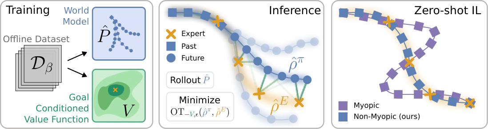

# ZILOT

This is the code release for the paper **Zero-Shot Imitation Learning via Optimal Transport**.
- [Webpage](https://sites.google.com/view/zsilot)
- [ArXiv](https://arxiv.org/abs/2410.08751)



## Abstract
Zero-shot imitation learning algorithms hold the promise of reproducing unseen behavior from as little as a single demonstration at test time.
Existing practical approaches view the expert demonstration as a sequence of goals, enabling imitation with a high-level goal selector, and a low-level goal-conditioned policy. 
However, this framework can suffer from myopic behavior: the agent's immediate actions towards achieving individual goals may undermine long-term objectives.
We introduce a novel method that mitigates this issue by directly optimizing the occupancy matching objective that is intrinsic to imitation learning. 
We propose to lift a goal-conditioned value function to a distance between occupancies, which are in turn approximated via a learned world model.
The resulting method can learn from offline, suboptimal data, and is capable of non-myopic, zero-shot imitation, as we demonstrate in complex, continuous benchmarks.

## Citation
```
@misc{rupf2024zeroshotofflineimitationlearning,
      title={Zero-Shot Offline Imitation Learning via Optimal Transport}, 
      author={Thomas Rupf and Marco Bagatella and Nico Gürtler and Jonas Frey and Georg Martius},
      year={2024},
      eprint={2410.08751},
      archivePrefix={arXiv},
      primaryClass={cs.LG},
      url={https://arxiv.org/abs/2410.08751}, 
}
```


# Installation
## Venv
```
python3.10 -m venv .venv
source .venv/bin/activate
pip install --upgrade pip
pip install torch==2.3.1 --index-url https://download.pytorch.org/whl/cu121
pip install -r requirements.txt
pip install -e .
```
or
```
./make_pip_env.sh
source .venv/bin/activate
```

## AWGCSL Data
Download the contents of the `hard_task_1e6` data from [AWGCSL](https://github.com/yangrui2015/awgcsl) [here](https://drive.google.com/drive/folders/1Gr8vgfCjHXgIXhlKvzCajQgqvBivPQJr?usp=drive_link) and copy the contents to `data/awgcsl/*` (the paths should be `data/awgcsl/<expert|random>/<env>/buffer.pkl`).

# Running the experiments
## W&B
This codebase makes extensive use of [Weights & Biases](https://wandb.ai) for logging.
Please create an account and run `wandb login` once to authenticate.

## Custom Curious Dataset
```
# fetch_slide_large_2D
python3 main.py job=dset name=fsl2D-dset-500k env=fetch_slide_large_2D steps=500_000 num_rollouts=5 log_dset_freq=250_000

# HalfCheetah
python3 main.py job=dset name=ch-dset-500k env=halfcheetah steps=500_000 num_rollouts=5 log_dset_freq=250_000
```

## Training
### From Custom Curious Datasets
```
python3 main.py job=train name=fsl2D-custom-500k env=fetch_slide_large_2D steps=600_000 dset=custom-0-500k log_model_freq=300_000 seed=0 num_rollouts=5
```
```
python3 main.py job=train name=ch-custom-500k env=halfcheetah steps=600_000 dset=custom-0-500k log_model_freq=300_000 seed=0 num_rollouts=5
```

### From AWGCSL Datasets
```
python3 main.py job=train name=fpp-awgcsl-all-600k env=fetch_pick_and_place steps=600_000 dset=awgcsl-all log_model_freq=300_000 seed=0 num_rollouts=5
```
```
main.py job=train name=fp-awgcsl-all-600k env=fetch_push steps=600_000 dset=awgcsl-all log_model_freq=300_000 seed=0 num_rollouts=5
```

### From D4RL/Minari Datasets
```
python3 main.py job=train name=pm-minari-600k env=pointmaze_medium steps=600_000 dset=minari log_model_freq=300_000 seed=0 num_rollouts=5
```

## Zero-Shot Evaluation
Running single planners on single tasks:
```
main.py job=eval num_rollouts=4 planner=<PLANNER> env_task=<ENV>-<TASK> render=True
```
for example:
```
main.py job=eval num_rollouts=4 planner=zilot env_task=fetch_slide_large_2D-S-sparse render=True zip_logs=True name=zilot-fetch_slide_large_2D-S-sparse

main.py job=eval num_rollouts=4 planner=mpc env_task=fetch_slide_large_2D-S-sparse render=True zip_logs=True cls_cfg.threshold=5.0 name=mpc-fetch_slide_large_2D-S-sparse
```
For a full evaluation of ZILOT and ablations, run
```
wandb sweep cfg/sweeps/A.yaml
wandb agent <SWEEP_ID>
```
and for the myopic planners, run
```
wandb sweep cfg/sweeps/B.yaml
wandb agent <SWEEP_ID>
```

# License
This codebase is released under the MIT license. Some parts of the codebase were adapted from other codebases. A comment was added to the code where this is the case. Those parts are governed by their respective licenses.
